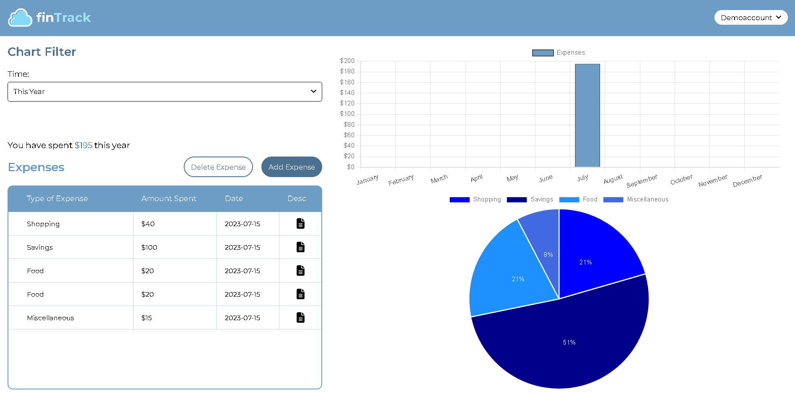

### **[Fin Track](https://fin-track.onrender.com/)**

## **Project Introduction:**

Fin Track is a comprehensive and intuitive application, simplifying personal finance management. Leveraging advanced technology, it offers a dynamic platform for budget planning and expense tracking, making it simpler than ever to understand and control your financial life.

Incorporating interactive data visualization, Fin Track allows users to gain insights into their spending habits. Whether you're setting up a monthly budget, tracking daily expenses, or analyzing spending patterns, Fin Track provides a seamless experience. Its user-friendly interface makes personal finance management not only a necessity, but a simplicity.

## **About The Project:**

Fin Track is a full-stack budget planner and expense tracking application, designed for insightful financial management with an intuitive user interface and seamless experience.

The common functionalities are:

- Users can create an account, log in, and log out securely
- Users can add and delete both expenses and budgets
- Provides users with a variety of options when creating an expense or budget, such as adding a description, type of budget/expense, the amount spent on an expense, and the maximum amount for a budget, among others
- Users can analyze their spending habits using the provided visualization tools with different types of charts
- Users can filter the charts to check their spending habits over different time frames, such as daily, weekly, monthly, and yearly

### **Built With:**

- React.js

- Node.js

- Express js

- JavaScript (ES6+)

- HTML/CSS

- Chart JS

- PostgreSQL

### **Key Concepts:**

- Data Management and Storage

- Security and Privacy

- Cors

- Axios

- Bcrypt JS

- Responsive Web Design

- Visualization Tools

- Component-based Architecture
